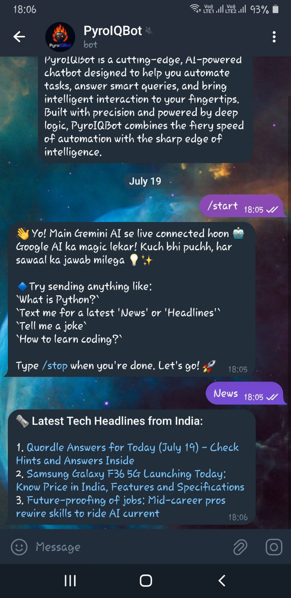
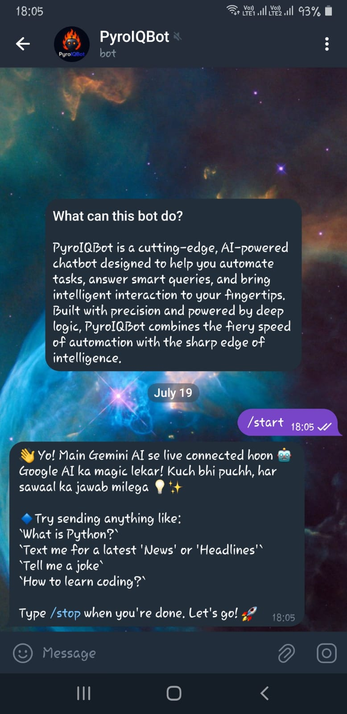
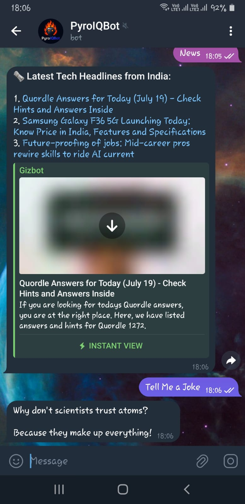
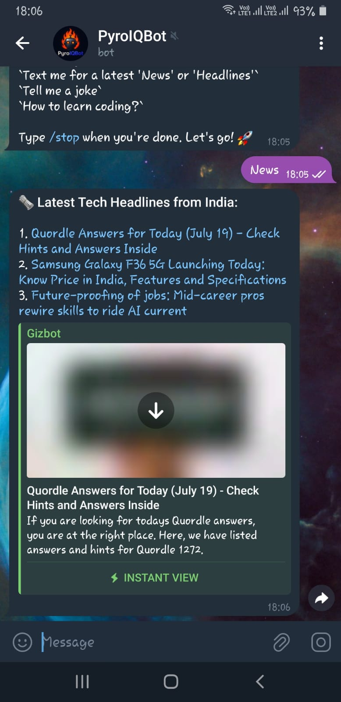
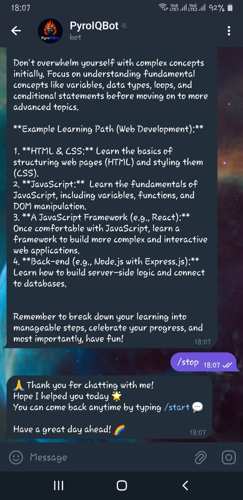

# 🤖 PyroIQBot – AI + News Telegram Bot

PyroIQBot is a feature-rich Telegram bot powered by **Google Gemini AI** and **NewsData API**, offering smart conversations and the latest tech news in real time.

---

## 🔍 What It Can Do

- 💬 Chat with Gemini AI directly on Telegram
- 📰 Get trending tech news instantly
- ⚡ Super fast, async, and easy-to-use
- 🛠️ Built with Python 
---

## 📸 Showcase

> Here's a glimpse of PyroIQBot in action:

  
  
  
   
  
  
  
   
  
  

---

## ⚙️ Tech Stack

- Python 3.11+
- Google Generative AI (`gemini-pro`)
- NewsData API (Tech news)
- Async/Await architecture

---

## 📄 License

This project is licensed under the MIT License.  
See the [LICENSE](LICENSE) file for details.

---

## 🙌 Contribute / Feedback

Pull requests and feedback are welcome. Feel free to open an issue or suggest features.  
